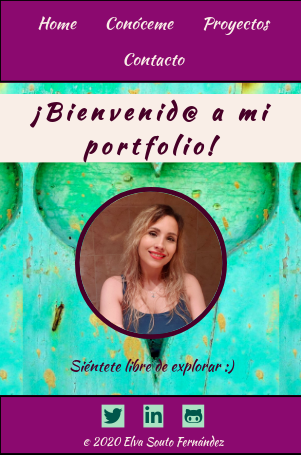
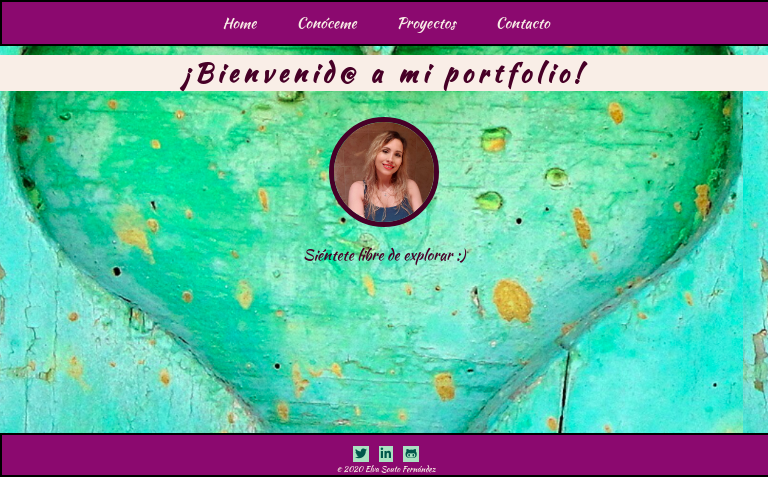
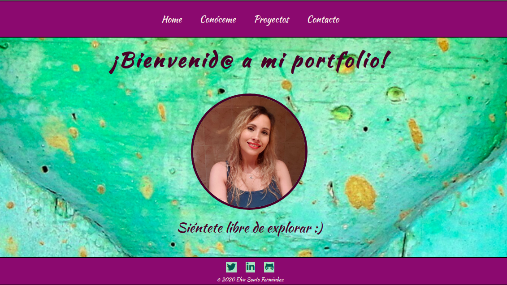

### My Portfolio: Elva Souto Fernández

Proyecto personal que consiste en una página web realizada a modo de CV online utilizando:
**HTML5 | SCSS/SASS | React | API fetch | Git&Github**,
y en el que he detallado:

- Quién soy
- Proyectos
- Contacto a través de email y redes sociales

##Para acceder a la página web, entrar en: https://elva-sf.github.io/my-portfolio/

La página web es **Responsive** y el diseño está adaptado a tres tamaños de dispositivos: **móvil, tablet y ordenador**.

Cuenta con un navegador que dirige a 4 secciones principales:

1. **HOME**: página de inicio. Contiene un título de bienvenida a la web junto con una imagen personal y un pequeño texto. Todos ellos tienen una pequeña **animación**.
2. **CONÓCEME**: contiene distintos párrafos en los que relato un poco sobre mí, asi como el porqué del cambio que he realizado en mi carrera profesional y el proceso que he realizado para llevar a cabo dicho cambio.
3. **PROYECTOS**: sección que muestra un listado de proyectos con una foto y nombre de cada uno. Dicho listado se puede **filtrar** por herramienta principal de desarrollo con un "select".
   Esta sección contiene a su vez otra sección que aparece al seleccionar cualquier proyecto del listado. Esta nueva sección contiene la **FICHA DEL PROYECTO** seleccionado con: foto, nombre, descripción breve, fecha en la que fue realizado, link al proyecto y un botón que navega de regreso al listado de proyectos.
4. **CONTACTO**: contiene un breve texto y la dirección personal de mi correo electrónico.

En todas las secciones aparece el **HEADER**, que consiste en el menú de navegación de la web (realizado con **React Router**), y el **FOOTER**, que contiene el copyright y los iconos de **Twitter**, **Linkdin** y **GitHub**, cada uno enlazado a mi cuenta personal de cada red social.

La estructura de carpetas se divide en:

- components: contiene los ficheros de los componentes realizados con React.
- images: contiene las imágenes utilizadas en el proyecto.
- services: contiene un fichero para realizar el API fetch.
- stylesheet: contiene a su vez otra estructura de carpetas para organizar los ficheros de las hojas de estilos realizadas con scss/sass.

Además, en la carpeta public, he incorporado una carpeta api para **crear una API** mediante un **fichero JSON** que contiene un array "projects", que a su vez contiene objetos con la información de cada proyecto: "name", "description", "id", "image", "date", "mainTool" y "link".

##Sección "Home" vista desde un Móvil:

##Sección "Home" vista desde una Tablet:

##Sección "Home" vista desde un Ordenador:

